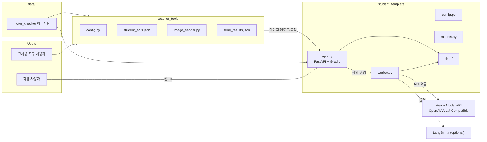

<div align="center">

# Motor Sticker Detection AI Agentic System


모터 부품 이미지에서 품질 검사용 스티커를 자동 검출하고, 색상·숫자를 인식하여 불량 여부를 판정하는 **Vision-Language Model 기반 AI 에이전트 시스템**입니다.

> AI 에이전트 부트캠프 **우수팀 1등** 선정 — 교내 성과보고회 발표

[](https://hpyquokka.tistory.com/5)

</div>

---

## Demo

<!-- 스크린샷/GIF를 docs/images/ 폴더에 저장 후 아래 주석을 해제하세요 -->
<!-- <div align="center">
  
  <p><em>실시간 품질 검사 대시보드 & AI 챗봇</em></p>
</div> -->

프로젝트의 대시보드 스크린샷, 분석 결과, LangSmith 모니터링 화면 등은 [프로젝트 블로그](https://hpyquokka.tistory.com/5)에서 확인할 수 있습니다.

## Highlights

- **Vision-Language Model 기반 자동 검출** — Qwen3-VL / GPT-4o를 활용하여 모터 부품 이미지에서 원형 스티커의 색상과 손글씨 숫자를 자동 인식
- **정교한 프롬프트 엔지니어링** — 흑백 이미지 색상 추론, 회전된 숫자 판별, 비모터 이미지 오탐지 방지 등 엣지 케이스를 단계적 프롬프트로 해결
- **Thinking Mode 재분석 전략** — 1차 분석 실패 시 `temperature=0.7` + `enable_thinking=True` 파라미터로 모델의 추론 과정을 활성화하여 재분석 정확도 향상
- **실시간 대시보드 & AI 챗봇** — Gradio 기반 UI에서 분석 현황 조회, 통계 시각화, 자연어 질의(재분석 요청 포함) 가능
- **배치 처리 파이프라인** — 3개씩 이미지를 그룹화하여 백그라운드 워커가 순차 분석, 교사용 도구로 대량 업로드 지원
- **LangSmith 통합 모니터링** — 모든 Vision API 호출과 챗봇 응답을 LangSmith로 추적하여 프롬프트 성능 분석 및 디버깅

## Architecture



## System Workflow

```
[1] 이미지 업로드 (POST /upload)
     │
     │  • 파일 검증: 이미지 형식, 10MB 이하
     │  • 타임스탬프 파일명: {YYYYMMDD_HHMMSS_ffffff}_{원본파일명}
     │  • 저장 위치: student_template/data/uploads/
     ▼
[2] 분석 시작 (POST /start-analysis)
     │
     │  • 백그라운드 워커 스레드 생성
     │  • 3개씩 배치 처리
     ▼
[3] Vision Model 1차 분석
     │
     │  [이미지 전처리]
     │  • RGBA → RGB 변환
     │  • 1024x1024 이하로 리사이징
     │  • JPEG 품질 85로 압축
     │  • Base64 인코딩
     │
     │  [API 호출]
     │  • OpenAI Compatible API 사용
     │  • max_tokens=150, temperature=0.1
     │  • 최대 3회 재시도 (502/500/503 오류)
     ▼
[4] 응답 파싱 및 불량 판정
     │
     │  • 초록색 → "정상"
     │  • 노란색 → "경미한 불량"
     │  • 빨간색 → "심각한 불량"
     ▼
[5] 결과 저장 → results.json
     │
     ▼
[6] 재분석 (사용자 요청 시)
     │
     │  • Thinking Mode 활성화 (enable_thinking: true)
     │  • temperature=0.7, max_tokens=8000
     │  • 모델이 추론 과정을 거쳐 더 신중하게 분석
     ▼
[7] 대시보드 실시간 반영
     │
     │  • Gradio UI에서 결과 테이블 자동 갱신
     │  • AI 챗봇으로 통계 질의 및 재분석 요청
```

## Prompt Engineering

### 설계 원칙

| 과제 | 해결 방법 |
|------|-----------|
| 흑백 이미지에서 스티커 색상 판별 불가 | 밝기(brightness) 기반 색상 추론 규칙 — 밝은 회색→초록, 중간→노란, 어두운→빨간 |
| 회전/뒤집힌 손글씨 숫자 오인식 | 밑줄 방향을 기준으로 정방향 판별 후 숫자 읽기 |
| 비모터 이미지(스티커 시트, 사무용품 등) 오탐지 | 1단계 유효성 검사 — "모터 부품 외부 커버" 여부를 먼저 판정 |
| 1차 분석 실패 시 정확도 저하 | Thinking Mode 재분석 — temperature↑, max_tokens↑로 심층 추론 유도 |

### 프로덕션 프롬프트 (worker.py)

```text
이 이미지에서 **모터 부품에 부착된** 품질 검사용 원형 스티커를 찾아주세요.

[1단계: 이미지 유효성 검사 - 가장 먼저 확인!]
이 이미지가 모터/기계 부품의 **스티커가 부착된 외부 커버** 사진인지 먼저 확인하세요.

다음과 같은 이미지는 has_sticker: false로 판정하세요:
- 스티커 시트/스티커 판매 이미지 (여러 스티커가 시트에 나열된 경우)
- 안내판, 게시판, 포스터, 인쇄물
- 사무용품, 문구류 이미지
- 모터/기계 부품이 아닌 일반 물체
- 손가락으로 스티커를 들고 있는 상품 사진
- 모터 내부 사진 (케이블, 배선, 기어, 코일 등만 보이는 경우)
- 카메라/모니터 화면을 찍은 사진 (화면 테두리, UI, 날짜/시간 표시가 보이는 경우)
- 스티커가 보이지 않는 모터 부품 사진

오직 **금속 모터 부품 외부 커버에 직접 부착된 원형 스티커**만 인식하세요!

[2단계: 스티커 특징 확인]
- 원형의 색깔 스티커 (초록색, 노란색, 또는 빨간색)
- 스티커 위에 손글씨로 쓰여진 2~3자리 숫자 (예: 96, 102, 505 등)
- 숫자 아래에 밑줄이 그어져 있을 수 있음 (밑줄은 숫자가 아님)

[숫자 인식 방법]
1. 이미지나 스티커가 거꾸로(180도 회전) 되어 있을 수 있습니다!
2. 밑줄이 있다면, 밑줄이 아래에 오도록 방향을 정하세요
3. 손글씨 숫자는 보통 2~3자리입니다
4. 숫자 '1'은 세로 막대 형태로, 밑줄과 구분해주세요

[색상 판별 방법]
1. 컬러 이미지: 스티커의 실제 색상을 직접 확인
2. 흑백 이미지: 밝기(brightness)로 원래 색상을 추론
   - 가장 밝은 회색 → "초록색"
   - 중간 밝기 → "노란색"
   - 어두운 회색 → "빨간색"

→ JSON 응답: { "has_sticker", "number", "color" }
```

### 1차 분석 vs 재분석 파라미터 비교

| 파라미터 | 1차 분석 | 재분석 (Thinking Mode) |
|----------|----------|----------------------|
| `temperature` | 0.1 | 0.7 |
| `max_tokens` | 150 | 8,000 |
| `enable_thinking` | - | `true` |
| 목적 | 빠르고 결정적인 판정 | 심층 추론으로 오류 보정 |

## Tech Stack

| 계층 | 기술 | 역할 |
|------|------|------|
| **Web Framework** |  | REST API 서버, 비동기 엔드포인트 |
| **UI** |  | 실시간 대시보드, 챗봇 인터페이스 |
| **Vision AI** |   | 이미지 분석, 스티커 검출 |
| **이미지 처리** |   | 전처리, 리사이징, Base64 인코딩 |
| **모니터링** |  | API 호출 추적, 프롬프트 성능 분석 |
| **HTTP Client** |  | 교사 도구 → 학생 서버 통신 |
| **Environment** |  | 환경 변수 관리 |

## Getting Started

### 사전 요구사항

- Python 3.10+
- GPU 환경 (vLLM 로컬 서버 사용 시) 또는 OpenAI API 키

### 1) 설치

```bash
cd student_template
pip install -r requirements.txt
```

### 2) 환경 변수 설정

`student_template/.env.example`을 복사하여 `.env` 파일을 생성하고 API 키를 입력하세요.

```bash
cp student_template/.env.example student_template/.env
# .env 파일을 열어 API_KEY, LANGSMITH_API_KEY 등을 설정
```

### 3) 서버 실행

```bash
cd student_template
python app.py
```

- API 서버: `http://localhost:8001`
- Gradio 대시보드: `http://localhost:7860`

### 4) vLLM 로컬 서버 (선택)

GPU 환경에서 Qwen 모델을 직접 서빙할 경우:

```bash
pip install vllm hf_transfer
vllm serve Qwen/Qwen3-VL-8B-Instruct --max-model-len 65536
```

### 5) 배치 업로드 (교사용 도구)

`teacher_tools/student_apis.json`에 학생 서버 주소를 입력한 뒤 실행합니다.

```bash
python teacher_tools/image_sender.py
```

## Project Structure

```
motor-sticker-detection/
├── student_template/
│   ├── app.py              # FastAPI + Gradio 엔트리포인트, 라우팅 & 대시보드
│   ├── worker.py           # 이미지 분석 워커, 프롬프트 정의, 재분석 로직
│   ├── models.py           # 데이터 모델, 이미지 인코딩, 불량 판정 유틸
│   ├── config.py           # 환경 변수 로드, 경로 설정
│   ├── .env.example        # 환경 변수 템플릿
│   ├── requirements.txt    # Python 의존성
│   └── data/
│       └── uploads/        # 업로드된 이미지 저장소
├── teacher_tools/
│   ├── image_sender.py     # 배치 이미지 업로드 스크립트 (tqdm 진행률)
│   ├── config.py           # 교사 도구 설정
│   ├── student_apis.json   # 학생 서버 주소 목록
│   ├── send_results.json   # 업로드 결과 로그
│   └── requirements.txt    # 교사 도구 의존성
├── data/
│   └── motor_checker_2/    # 샘플 이미지 데이터셋
│       ├── *.jpg           # 원본 이미지
│       ├── blurred/        # 블러 처리된 이미지
│       ├── grayscale/      # 흑백 변환 이미지
│       └── test_img/       # 오탐지 테스트용 이미지 (비모터 이미지 포함)
├── requirements.txt        # 프로젝트 루트 의존성
└── README.md
```

## 기술적 도전과 배운 점

### 1. 흑백 이미지에서 색상 추론

> **문제**: 공장 CCTV 이미지가 흑백인 경우 스티커 색상 판별이 불가능

**해결**: DANGER 경고 라벨의 빨간/노란 영역을 밝기 기준점으로 활용하는 프롬프트 전략을 설계했습니다. 이후 더 범용적인 접근으로 **밝기(brightness) 기반 3단계 분류** 규칙을 도입하여 DANGER 라벨이 없는 이미지에도 대응했습니다.

### 2. 회전된 손글씨 숫자 인식

> **문제**: 이미지가 180도 회전되어 "96"이 "96"으로 읽히지 않는 경우

**해결**: **밑줄 방향을 앵커 포인트로 활용** — "밑줄이 있다면 밑줄이 아래에 오도록 방향을 정하세요"라는 규칙으로 모델이 올바른 방향을 판단하도록 유도했습니다.

### 3. 비모터 이미지 오탐지

> **문제**: 스티커 시트, 사무용품 등 모터와 무관한 이미지에서도 스티커를 "발견"하는 false positive

**해결**: **1단계 유효성 검사를 프롬프트 최상단에 배치** — 스티커 분석 이전에 "이 이미지가 모터 부품 외부 커버인지" 먼저 판정하는 가드레일을 추가했습니다. `test_img/` 폴더의 다양한 비모터 이미지로 검증했습니다.

### 4. 서버 불안정 대응

> **문제**: vLLM/RunPod 서버에서 간헐적으로 502/503 오류 발생

**해결**: **지수 백오프(Exponential Backoff) 재시도** 로직을 구현했습니다. 2초 → 4초 → 6초 간격으로 최대 3회 재시도하며, 일시적 서버 오류에 자동 복구됩니다.

## References

- [FastAPI Documentation](https://fastapi.tiangolo.com/)
- [Gradio Documentation](https://gradio.app/docs/)
- [vLLM Documentation](https://docs.vllm.ai/)
- [Qwen Model — Hugging Face](https://huggingface.co/Qwen)
- [OpenAI Vision API](https://platform.openai.com/docs/guides/vision)
- [LangSmith Documentation](https://docs.smith.langchain.com/)
