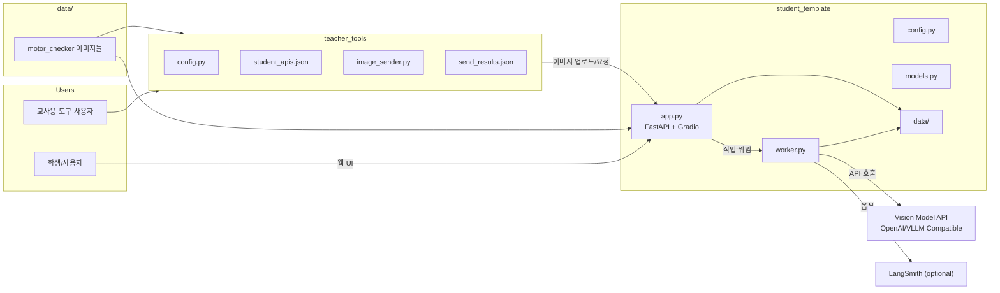

# Motor Sticker Detection System

이미지에서 모터 스티커를 자동으로 검출하고 불량 여부를 판단하는 AI 기반 품질 검사 시스템입니다.

- 프로젝트 블로그: https://hpyquokka.tistory.com/5

## Highlights

- FastAPI 기반 분석 API + Gradio 대시보드
- vLLM/OpenAI 호환 API 연동 (로컬 또는 외부 모델)
- 배치 업로드를 위한 교사용 도구(`teacher_tools`) 포함
- 결과를 JSON/CSV로 저장해 통계/리뷰에 활용

## Architecture



## System Workflow

```
[1] 이미지 업로드 (POST /upload)
     │
     │  • 파일 검증: 이미지 형식, 10MB 이하
     │  • 타임스탬프 파일명: {YYYYMMDD_HHMMSS_ffffff}_{원본파일명}
     │  • 저장 위치: student_template/data/uploads/
     ▼
[2] 분석 시작 (POST /start-analysis)
     │
     │  • 백그라운드 워커 스레드 생성
     │  • 3개씩 배치 처리
     ▼
[3] Vision Model 분석
     │
     │  [이미지 전처리]
     │  • RGBA → RGB 변환
     │  • 1024x1024 이하로 리사이징
     │  • JPEG 품질 85로 압축
     │  • Base64 인코딩
     │
     │  [API 호출]
     │  • OpenAI Compatible API 사용
     │  • max_tokens=150, temperature=0.1
     │  • 최대 3회 재시도 (502/500/503 오류)
     ▼
[4] 응답 파싱 및 불량 판정
     │
     │  • 초록색 → "정상"
     │  • 노란색 → "경미한 불량"
     │  • 빨간색 → "심각한 불량"
     ▼
[5] 결과 저장 → results.json
```

## Prompt Design

### 스티커 분석 프롬프트

```
모터 부품 이미지에서 품질 검사용 원형 스티커를 찾아주세요.

[스티커 특징]
- 원형의 색깔 스티커 (초록색, 노란색, 또는 빨간색)
- 스티커 위에 손글씨로 쓰여진 3자리 숫자 (예: 102, 169, 213 등)
- 숫자 아래에 밑줄이 그어져 있을 수 있음 (밑줄은 숫자가 아님)

[색상 판별 방법]
1. 컬러 이미지인 경우: 스티커의 실제 색상을 직접 확인
   - 초록색, 노란색, 빨간색 중 하나

2. 이미지가 흑백인 경우, DANGER 경고 스티커를 기준으로 색상을 판별:
   - DANGER 스티커에는 빨간색 영역(어두운 회색)과 노란색 번개 마크(중간 밝기)가 있습니다
   - 원형 스티커가 DANGER의 빨간색 영역과 비슷한 밝기 → 빨간색
   - 원형 스티커가 DANGER의 노란색 번개와 비슷한 밝기 → 노란색
   - 원형 스티커가 둘 다보다 밝음 (가장 연한 회색) → 초록색

[숫자 인식 주의사항]
- 손글씨 숫자는 보통 3자리입니다
- 숫자 '1'은 세로 막대 형태로, 밑줄과 구분해주세요
- 밑줄은 숫자의 일부가 아닙니다

다음 JSON 형식으로만 답변해주세요:
{
    "has_sticker": true/false,
    "number": "숫자" 또는 null,
    "color": "초록색"/"노란색"/"빨간색" 또는 null
}
```

### 챗봇 시스템 프롬프트

```
당신은 모터 부품 품질 검사 시스템의 AI 어시스턴트입니다.
사용자가 분석 결과에 대해 질문하면, 제공된 데이터를 바탕으로 명확하고 간결하게 답변해주세요.

역할:
- 불량품 현황과 통계를 요약해드립니다
- 품질 트렌드를 분석해드립니다
- 개선이 필요한 부분을 파악해드립니다
```

## Tech Stack

| 계층              | 기술                              |
| ----------------- | --------------------------------- |
| **Web Framework** | FastAPI                           |
| **UI**            | Gradio                            |
| **Vision AI**     | Qwen/vLLM (OpenAI Compatible API) |
| **이미지 처리**   | Pillow, OpenCV                    |
| **모니터링**      | LangSmith                         |
| **HTTP Client**   | requests, tqdm                    |
| **Environment**   | python-dotenv                     |

## Installation

### 1) vLLM 서버 설정 (GPU 환경, 선택)

```bash
pip install vllm hf_transfer
vllm serve Qwen/Qwen3-VL-8B-Instruct --max-model-len 65536
```

### 2) 학생 서버 설치

```bash
cd student_template
pip install -r requirements.txt
```

### 3) 환경 변수 설정 (.env)

`student_template/.env` 파일을 생성해 아래 값을 설정하세요.

```
API_BASE_URL=http://localhost:8000/v1    # vLLM 서버 주소
API_KEY=your-api-key                     # 외부 API 사용 시 필요
MODEL_NAME=Qwen/Qwen3-VL-8B-Instruct

SERVER_PORT=8001                         # vLLM과 포트 충돌 방지
GRADIO_PORT=7860

LANGSMITH_API_KEY=your-langsmith-key     # 선택사항
LANGSMITH_PROJECT=motor-sticker-detection
LANGSMITH_TRACING=false
```

### 4) 서버 실행

```bash
cd student_template
python app.py
```

- API 서버: `http://localhost:8001`
- Gradio 대시보드: `http://localhost:7860`

## Teacher Tools (배치 업로드)

`teacher_tools/student_apis.json`에 학생 서버 주소를 입력한 뒤 실행합니다.

```bash
python teacher_tools/image_sender.py
```

## Project Structure

- `student_template/app.py`: FastAPI + Gradio 엔트리
- `student_template/worker.py`: 이미지 처리 및 모델 호출
- `student_template/config.py`: 환경 변수/경로 설정
- `teacher_tools/`: 배치 업로드 및 테스트 도구
- `data/`: 샘플 이미지/테스트 리소스

## Public Repo Notes

- `.env` 및 키 파일은 커밋하지 마세요. (`.gitignore`에 포함됨)
- 샘플 이미지/데이터의 공개 여부는 사용 권한을 확인하세요.

## License

이 프로젝트는 교육 목적으로 사용됩니다.

## References

- [FastAPI Documentation](https://fastapi.tiangolo.com/)
- [Gradio Documentation](https://gradio.app/docs/)
- [vLLM Documentation](https://docs.vllm.ai/)
- [Qwen Model](https://huggingface.co/Qwen)
